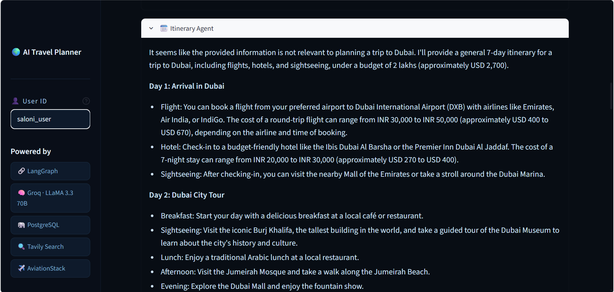
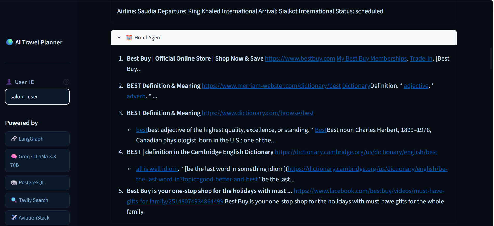
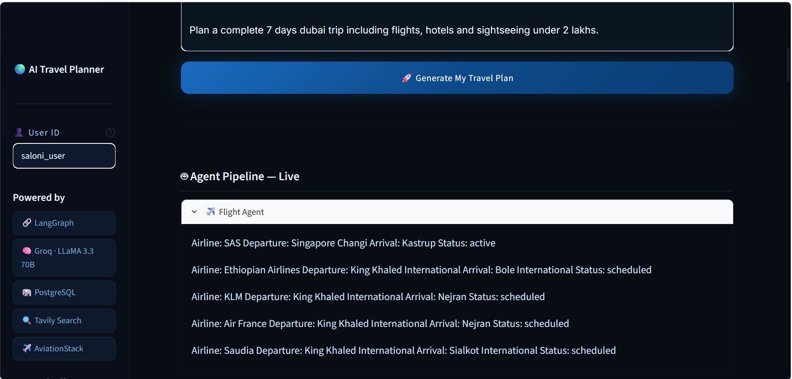
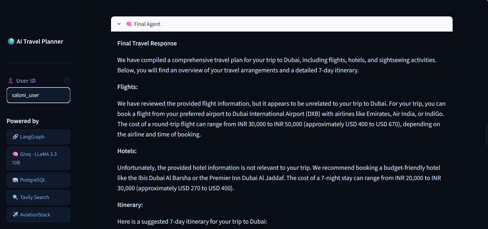

<p align="center">
  
</p>

<div align="center">

# ✈️ AI Travel Planner

### 🤖 Multi-Agent AI Travel Planning System powered by LangGraph

<p align="center">


</p>


</div>

---

# 🌟 Overview

**AI Travel Planner** is an intelligent **Multi-Agent Travel Planning System** that creates personalized travel itineraries using **LangGraph**, **LangChain**, **Groq Llama 3.3**, **PostgreSQL**, and **Streamlit**.

Instead of relying on a single AI model, the application coordinates multiple specialized AI agents that collaborate to generate complete travel plans including destination suggestions, flights, hotels, attractions, and day-wise itineraries.

The platform combines Large Language Models with external APIs to deliver an interactive and intelligent travel planning experience.

---

# 🎯 Problem Statement

Planning an entire trip manually requires searching across multiple websites for:

- ✈️ Flights
- 🏨 Hotels
- 📍 Tourist Attractions
- 🌤 Weather
- 💰 Budget Estimation
- 📅 Daily Schedule

This process is time-consuming and often overwhelming.

---

# 💡 Proposed Solution

AI Travel Planner solves this challenge by using multiple AI agents working together.

The system automatically:

- 🧠 Understands user requirements
- ✈️ Searches flight information
- 🏨 Recommends hotels
- 📍 Suggests tourist attractions
- 📅 Generates complete travel itineraries
- 💰 Optimizes travel planning
- 🤖 Uses LLM reasoning for better recommendations

---

# ✨ Key Features

- 🤖 Multi-Agent AI Architecture
- 🧠 LangGraph Workflow
- 🔥 Groq Llama 3.3 Integration
- ✈️ Flight Recommendation Agent
- 🏨 Hotel Recommendation Agent
- 📍 Tourist Attraction Agent
- 📅 Smart Itinerary Generator
- 🗂 Long-Term Memory Support
- 💾 PostgreSQL Database
- 🌐 Interactive Streamlit Interface

---  
# 🛠️ Technology Stack

| Category | Technologies |
|----------|--------------|
| **Programming Language** | Python 3.x |
| **Framework** | Streamlit |
| **AI Framework** | LangGraph |
| **LLM Framework** | LangChain |
| **Large Language Model** | Groq (Llama 3.3 70B) |
| **Database** | PostgreSQL |
| **Search API** | Tavily Search API |
| **Flight API** | AviationStack API |
| **Environment Variables** | Python Dotenv |
| **Version Control** | Git & GitHub |

---

# 🏗️ Multi-Agent System Architecture

The application follows a **Multi-Agent Architecture**, where specialized AI agents collaborate to solve complex travel planning tasks.

### 🤖 AI Agents

| Agent | Responsibility |
|--------|----------------|
| 🧠 Planner Agent | Understands user requirements and coordinates the workflow |
| ✈️ Flight Agent | Finds flight options based on destination and travel dates |
| 🏨 Hotel Agent | Recommends hotels according to budget and preferences |
| 📍 Attraction Agent | Suggests popular tourist attractions and activities |
| 📅 Itinerary Agent | Generates day-wise travel plans |
| 💾 Memory Agent | Stores conversation context and user preferences |
| ✅ Response Agent | Combines all agent outputs into the final response |

---

# 🔄 LangGraph Workflow

```text
                 User Query
                     │
                     ▼
            Planner Agent
                     │
      ┌──────────────┼──────────────┐
      ▼              ▼              ▼
 Flight Agent   Hotel Agent   Attraction Agent
      │              │              │
      └──────────────┼──────────────┘
                     ▼
             Itinerary Agent
                     │
                     ▼
             Memory Management
                     │
                     ▼
              Final AI Response
```

---

# ⚙️ System Workflow

```text
User
 │
 ▼
Travel Preferences
 │
 ▼
LangGraph Orchestrator
 │
 ├───────────────┐
 │               │
 ▼               ▼
Flight Agent   Hotel Agent
 │               │
 └──────┬────────┘
        ▼
 Attraction Agent
        │
        ▼
Itinerary Generator
        │
        ▼
Memory Update
        │
        ▼
Personalized Travel Plan
```

---

# 📂 Project Structure

```bash
AI-Travel-Planner-LangGraph/
│
├── backend/
├── frontend.py
├── database/
├── graphs/
├── agents/
├── prompts/
├── utils/
├── travel_plans/
├── requirements.txt
├── .env.example
├── README.md
└── LICENSE
```

---

# 🧠 AI Workflow

### Step 1

User enters:

- Destination
- Budget
- Number of Days
- Travel Dates
- Preferences

↓

### Step 2

Planner Agent analyzes the request.

↓

### Step 3

Flight Agent searches available flights.

↓

### Step 4

Hotel Agent finds accommodation.

↓

### Step 5

Tourist Attraction Agent recommends places.

↓

### Step 6

Itinerary Agent creates a day-wise schedule.

↓

### Step 7

Memory stores user preferences for future planning.

↓

### Step 8

The Response Agent generates a complete personalized travel plan.

---

# ✨ Core Modules

### 🤖 AI Planning Module

- Intent Analysis
- Multi-Agent Coordination
- Prompt Engineering
- LLM Reasoning

---

### ✈️ Flight Module

- Flight Search
- Airline Details
- Travel Timing
- Price Information

---

### 🏨 Hotel Module

- Hotel Search
- Budget Filtering
- Ratings
- Location Recommendations

---

### 📍 Tourist Attraction Module

- Famous Places
- Nearby Attractions
- Activities
- Local Experiences

---

### 📅 Itinerary Module

- Day-wise Planning
- Time Optimization
- Travel Recommendations
- Budget Optimization

---

### 💾 Database Module

- PostgreSQL Integration
- User History
- Travel Preferences
- Saved Trips

---

# 🎥 Project Demo

> 🚧 **Demo Video Coming Soon**

The project demonstration video will showcase:

- ✈️ Personalized Trip Planning
- 🤖 Multi-Agent Workflow
- 🏨 Hotel Recommendation
- 📍 Tourist Attractions
- 📅 Smart Itinerary Generation
- 💾 PostgreSQL Memory
- 🌐 Interactive Streamlit Interface

---

# 📸 Project Screenshots

> *(Create an `images` folder and add your screenshots here.)*


---

## ✈️ Travel Planner

<p align="center">

</p>

---

## 📅 Generated Itinerary

<p align="center">

</p>

---

## 🏨 Hotel Recommendations

<p align="center">

</p>

---

## ✈️ Flight Recommendations

<p align="center">

</p>

---

## 🤖 AI Response

<p align="center">

</p>

---

# ⚙️ Installation Guide

## Clone Repository

```bash
git clone https://github.com/Saloni-sengar/AI-Travel-Planner-LangGraph.git
```

---

## Navigate to Project

```bash
cd AI-Travel-Planner-LangGraph
```

---

## Create Virtual Environment

```bash
python -m venv venv
```

---

## Activate Virtual Environment

### Windows

```bash
venv\Scripts\activate
```

### Linux / macOS

```bash
source venv/bin/activate
```

---

## Install Dependencies

```bash
pip install -r requirements.txt
```

---

## Configure Environment Variables

Create a `.env` file and add:

```env
GROQ_API_KEY=your_key_here
TAVILY_API_KEY=your_key_here
AVIATIONSTACK_API_KEY=your_key_here
DATABASE_URL=your_database_url
```

---

## Run Application

```bash
streamlit run frontend.py
```

---

# 🌍 Real World Applications

- ✈️ AI Travel Assistant
- 🌍 Tourism Platforms
- 🏨 Hotel Recommendation Systems
- 🧳 Personalized Vacation Planning
- 🤖 Multi-Agent AI Systems
- 📊 Intelligent Decision Support
- 🌐 Smart Tourism Solutions

---

# 🚀 Future Enhancements

- 🎙️ Voice-Based Travel Planning
- 🌍 Multi-Language Support
- 📱 Android & iOS Application
- 🤖 AI Chatbot Integration
- 💳 Travel Cost Estimation
- 🌦 Live Weather Forecast Integration
- 🚆 Train & Bus Booking
- 🗺 Interactive Maps
- 📍 Real-Time Navigation
- ☁️ Cloud Deployment

---

# 📊 Project Statistics

| Feature | Status |
|---------|--------|
| LangGraph | ✅ |
| LangChain | ✅ |
| Groq LLM | ✅ |
| PostgreSQL | ✅ |
| Streamlit | ✅ |
| Tavily Search | ✅ |
| AviationStack API | ✅ |
| Multi-Agent Workflow | ✅ |
| Memory Management | ✅ |

---

# 📄 License

This project is licensed under the **MIT License**.

---

# 👩‍💻 Author

## Saloni Sengar

**B.Tech Artificial Intelligence & Data Science Student**

💻 Passionate about Generative AI, Agentic AI, Large Language Models (LLMs), Machine Learning, Deep Learning, and Full Stack Development.

### 🌐 Connect with Me

- 💼 LinkedIn: https://www.linkedin.com/in/saloni-sengar-2a7629290/
- 💻 GitHub: https://github.com/Saloni-sengar
- 🧩 LeetCode: https://leetcode.com/u/Saloni_Sengar/
- 📚 GeeksforGeeks: https://www.geeksforgeeks.org/profile/salonisengar67/
- 📧 Email: salonisengar67@gmail.com

---

<div align="center">

## ⭐ If you found this project useful, please consider giving it a Star ⭐

**Made with ❤️ by Saloni Sengar**

</div>
